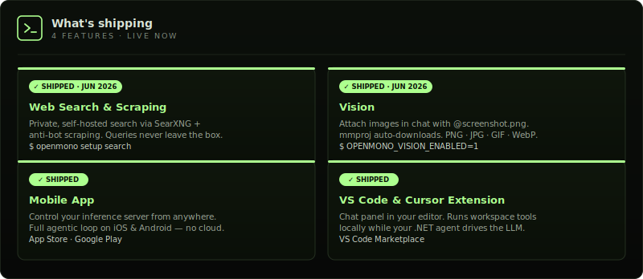
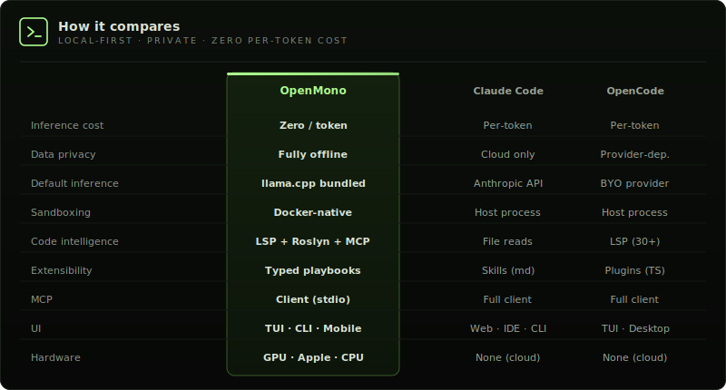
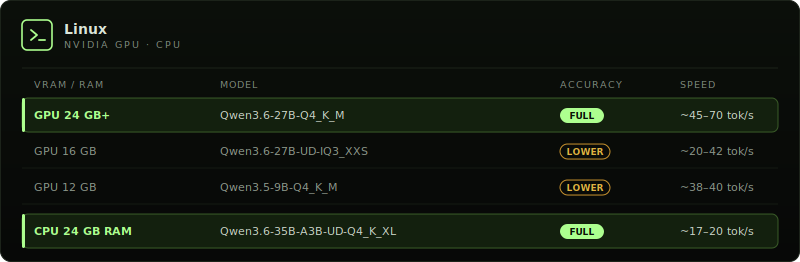
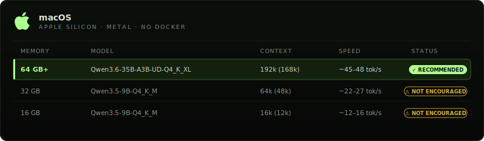

<div align="center">
  
</div>

<div align="center">
  <strong>Open-source coding agent. Local-first. Zero cost. Zero cloud.</strong><br/>
  <sub>Built to democratize AI. Powered by .NET.</sub>
</div>

<br>

<div align="center">
  <a href="#quickstart">Quickstart</a> · <a href="#whats-shipping">What's shipping</a> · <a href="#how-it-compares">How it compares</a> · <a href="#whats-inside">What's inside</a> · <a href="#supported-hardware">Hardware</a> · <a href="#docs">Docs</a> · <a href="ROADMAP.md">Roadmap</a> · <a href="#contributing">Contributing</a>
</div>

<br>

<div align="center">
  
</div>

<br>

<div align="center">
  
  
  
  
  
  
  
</div>

---

OpenMono is a coding agent that runs **entirely on your hardware** — no subscriptions, no data leaving your network, no per-token billing. It pairs a .NET 10 CLI with its own llama.cpp inference server, giving you a full agentic loop with **20 built-in tools**, Docker sandboxing, and deep code intelligence. NVIDIA GPU, CPU, or Apple Silicon (Metal) — **it auto-configures itself**. You own the model, the compute, and the data.

---

## Quickstart

One command. Auto-detects GPU · CPU · Apple Silicon. Installs model, runtime, and Docker containers.

```bash
bash <(curl -fsSL https://raw.githubusercontent.com/StartupHakk/OpenMonoAgent.ai/refs/heads/main/get-openmono.sh)
```

Then from any project:

```bash
openmono agent            # TUI mode (default)
openmono agent --classic  # classic scrolling terminal
```

<sub><a href="docs/SETUP.md">→ Full command reference</a> — daily commands, setup flags, GPU/CPU options</sub>

<br/>

<div align="center">
  
</div>

---

<!--  ── WHAT'S SHIPPING ─────────────────────────────────────── -->
## What's shipping

<div align="center">
  
</div>

<sub><strong>Get them:</strong> <code>openmono setup search</code> · <code>OPENMONO_VISION_ENABLED=1</code> · <a href="https://apps.apple.com/us/app/openmono-ai-coding-agent/id6766077801">App Store</a> · <a href="https://play.google.com/store/apps/details?id=ai.openmonoagent.app&hl=en_US">Google Play</a> · <a href="https://marketplace.visualstudio.com/items?itemName=StartupHakk.openmono-agent">VS Code Marketplace</a></sub>

---

<!--  ── HOW IT COMPARES ─────────────────────────────────────── -->
## How it compares

Most coding agents are cloud products wearing an open-source label. Your prompts, your code, and your context hit someone else's servers on every keystroke. OpenMono runs the model on your hardware — after the one-time setup, **inference costs nothing**. Your code never leaves the machine. No account. No usage dashboard. No API key.

<div align="center">
  <a href="docs/ARCHITECTURE.md"></a>
</div>


→ [Full architecture + diagram](docs/ARCHITECTURE.md) · [4 providers](docs/MODELS.md) · runs at **~45 tok/s on GPU**, ~20 tok/s on CPU

---

## What's inside

<table>
<tr>
<td width="50%" valign="top">

<strong style="color:#A3FF66;">01</strong> · **Bundled inference — zero config, zero cost**  
llama.cpp ships inside Docker. Installer detects your hardware and picks the right model. After setup, every token is free.

`GPU` Qwen3.6-27B dense · ~60 tok/s  
`CPU` Qwen3.6-35B-A3B MoE · ~20 tok/s  
`Mac` Qwen3.6-35B-A3B MoE · Metal · ~45–48 tok/s

→ [Models & reasoning mode](docs/MODELS.md)

</td>
<td width="50%" valign="top">

<strong style="color:#A3FF66;">02</strong> · **Agentic loop that earns its name**  
25 iterations per turn. Doom-loop detection aborts if the same tool sequence repeats 3×. Checkpoints at 65% context fill, compacts at 80%. Runs until done — then stops.

</td>
</tr>
<tr>
<td valign="top">

<strong style="color:#A3FF66;">03</strong> · **[20 tools](docs/ARCHITECTURE.md), 12-step pipeline**  
Every call: parse → schema validate → path sanity → plan-mode guard → capability check → cache → pre-hook → execute → post-hook → artifact store. Read-only tools run in parallel. Nothing bypasses the pipeline.

</td>
<td valign="top">

<strong style="color:#A3FF66;">04</strong> · **5 specialist sub-agents**  
Isolated sessions with locked tool sets and turn budgets:

`Explore` · read-only discovery · 15 turns  
`Plan` · architecture, no writes · 10 turns  
`Coder` · full file access · 30 turns  
`Verify` · adversarial + Roslyn · 20 turns  
`general-purpose` · everything · 25 turns

</td>
</tr>
<tr>
<td valign="top">

<strong style="color:#A3FF66;">05</strong> · **Docker sandbox**  
Project mounts as `/workspace`. The agent reads and writes your real files — that's the blast radius. Nothing outside that mount is visible or reachable.

</td>
<td valign="top">

<strong style="color:#A3FF66;">06</strong> · **Deep code intelligence**  
Roslyn: type hierarchy, blast-radius, cross-file symbol search, callers, diagnostics — 5-min compilation cache. LSP for TypeScript, Python, Go, Rust, lazy-started on first use.

Auto-detects [graphify](docs/graphify.md) (semantic concept graph, 25+ languages) and [code-review-graph](docs/code-review-graph.md) (structural call graph via MCP, ~22 tools) if installed — no config needed.

</td>
</tr>
<tr>
<td valign="top">

<strong style="color:#A3FF66;">07</strong> · **[Playbooks](docs/PLAYBOOKS.md)**  
YAML workflows with typed parameters, conditional gates, and checkpoint/resume. Composable — one playbook can call another.

</td>
<td valign="top">

<strong style="color:#A3FF66;">08</strong> · **[4 providers](docs/MODELS.md), hot-swappable**  
Local llama.cpp is the default and fully supported. OpenAI, Anthropic, and Ollama are available but WIP — see [Models](docs/MODELS.md) for details.

</td>
</tr>
<tr>
<td valign="top">

<strong style="color:#A3FF66;">09</strong> · **Distributed inference**  
Agent on your laptop, inference on a separate GPU machine. No port forwarding — tunnel is established outbound from the inference box. Free relay at [app.openmonoagent.ai](https://app.openmonoagent.ai).

→ [Dual-box setup guide](docs/SETUP.md#dual-box-setup)

</td>
<td valign="top">

<strong style="color:#A3FF66;">10</strong> · **Vision**  
Attach images in chat with `@screenshot.png` or ask the agent to read any image file. The multimodal projector (mmproj) is downloaded automatically at setup. Supported formats: PNG, JPG, GIF, WebP. Large images are auto-resized to fit within VRAM budget. Enable with `OPENMONO_VISION_ENABLED=1`.

→ [Vision setup & usage](docs/SETUP.md#vision)

</td>
</tr>
<tr>
<td valign="top">

<strong style="color:#A3FF66;">11</strong> · **Private web search & scraping**  
Self-hosted search via SearXNG — your queries never leave the machine. Anti-bot scraping via Scrapling + Camoufox (real browser, Cloudflare bypass). Single Caddy gateway, auto-detected. Falls back to DuckDuckGo / direct fetch when the gateway is absent.

`openmono setup search` · `openmono setup scraper`

→ [Web services architecture](docs/ARCHITECTURE.md#inference-side-web-services-caddy-gateway)

</td>
<td valign="top">

<strong style="color:#A3FF66;">12</strong> · **VS Code extension**  
The full agent loop in your editor sidebar — streaming responses, live Markdown, file edits, bash, and permission prompts without leaving VS Code. Connects to the local agent over ACP on port `7475`. Also works in Cursor.

`code --install-extension StartupHakk.openmono-agent`

→ [Extension docs](docs/SETUP.md#vs-code--cursor-extension) · [Marketplace](https://marketplace.visualstudio.com/items?itemName=StartupHakk.openmono-agent)

</td>
</tr>
</table>

<div align="center">
  
</div>

---

<!--  ── SUPPORTED HARDWARE ──────────────────────────────────── -->
## Supported Hardware

<div align="center">
  
</div>

<br/>

<div align="center">
  
</div>

<sub>Auto-detects GPU · CPU · no config needed. On Linux, 12 GB and 16 GB cards run lower-accuracy models; use a 24 GB card for best results. Requires Ubuntu 26.04 LTS (recommended) or 25.10. On macOS, the full and inference roles require Apple Silicon (M1+); 64 GB+ unified memory is the recommended, tested configuration. Less than 64 GB is not encouraged — smaller model, much tighter context window. Intel Macs: agent-only mode. macOS 14+ (Sonoma/Sequoia) recommended.</sub>


---

<!--  ── DOCS ────────────────────────────────────────────────── -->
## Docs

<table width="100%" style="border-collapse:collapse;background:#111111;border:1px solid #232323;border-radius:4px;">
  <tr>
    <td width="30%" style="padding:9px 16px;border-bottom:1px solid #1A1A1A;border-right:1px solid #232323;"><a href="ROADMAP.md"><code style="font-size:12px;">Roadmap</code></a></td>
    <td style="padding:9px 16px;border-bottom:1px solid #1A1A1A;"><sub style="color:#C8C8C0;">What's next</sub></td>
  </tr>
  <tr>
    <td style="padding:9px 16px;border-bottom:1px solid #1A1A1A;border-right:1px solid #232323;"><a href="docs/SETUP.md"><code style="font-size:12px;">Setup &amp; commands</code></a></td>
    <td style="padding:9px 16px;border-bottom:1px solid #1A1A1A;"><sub style="color:#C8C8C0;">Daily commands, TUI vs classic, flags</sub></td>
  </tr>
  <tr>
    <td style="padding:9px 16px;border-bottom:1px solid #1A1A1A;border-right:1px solid #232323;"><a href="docs/ARCHITECTURE.md"><code style="font-size:12px;">Architecture</code></a></td>
    <td style="padding:9px 16px;border-bottom:1px solid #1A1A1A;"><sub style="color:#C8C8C0;">.NET CLI + llama.cpp + Docker, full diagram</sub></td>
  </tr>
  <tr>
    <td style="padding:9px 16px;border-bottom:1px solid #1A1A1A;border-right:1px solid #232323;"><a href="docs/MODELS.md"><code style="font-size:12px;">Models &amp; reasoning</code></a></td>
    <td style="padding:9px 16px;border-bottom:1px solid #1A1A1A;"><sub style="color:#C8C8C0;">Model tiers, reasoning mode, provider config</sub></td>
  </tr>
  <tr>
    <td style="padding:9px 16px;border-bottom:1px solid #1A1A1A;border-right:1px solid #232323;"><a href="docs/CONFIG.md"><code style="font-size:12px;">Configuration</code></a></td>
    <td style="padding:9px 16px;border-bottom:1px solid #1A1A1A;"><sub style="color:#C8C8C0;">settings.json, providers, permissions, MCP servers</sub></td>
  </tr>
  <tr>
    <td style="padding:9px 16px;border-bottom:1px solid #1A1A1A;border-right:1px solid #232323;"><a href="docs/PLAYBOOKS.md"><code style="font-size:12px;">Playbooks</code></a></td>
    <td style="padding:9px 16px;border-bottom:1px solid #1A1A1A;"><sub style="color:#C8C8C0;">YAML workflows, typed params, checkpoint/resume</sub></td>
  </tr>
  <tr>
    <td style="padding:9px 16px;border-bottom:1px solid #1A1A1A;border-right:1px solid #232323;"><a href="docs/graphify.md"><code style="font-size:12px;">graphify</code></a></td>
    <td style="padding:9px 16px;border-bottom:1px solid #1A1A1A;"><sub style="color:#C8C8C0;">Semantic code graph, 25+ languages</sub></td>
  </tr>
  <tr>
    <td style="padding:9px 16px;border-bottom:1px solid #1A1A1A;border-right:1px solid #232323;"><a href="docs/code-review-graph.md"><code style="font-size:12px;">code-review-graph</code></a></td>
    <td style="padding:9px 16px;border-bottom:1px solid #1A1A1A;"><sub style="color:#C8C8C0;">Structural call graph via MCP</sub></td>
  </tr>
  <tr>
    <td style="padding:9px 16px;border-bottom:1px solid #1A1A1A;border-right:1px solid #232323;"><a href="docs/SETUP.md#vs-code--cursor-extension"><code style="font-size:12px;">VS Code extension</code></a></td>
    <td style="padding:9px 16px;border-bottom:1px solid #1A1A1A;"><sub style="color:#C8C8C0;">Chat panel for VS Code 1.85+ · also works in Cursor · <a href="https://marketplace.visualstudio.com/items?itemName=StartupHakk.openmono-agent">Marketplace</a></sub></td>
  </tr>
  <tr>
    <td style="padding:9px 16px;border-right:1px solid #232323;"><a href="CONTRIBUTING.md"><code style="font-size:12px;">Contributing</code></a></td>
    <td style="padding:9px 16px;"><sub style="color:#C8C8C0;">How to contribute</sub></td>
  </tr>
</table>

<br/>

<table width="100%" style="border-collapse:collapse;background:#111111;border:1px solid #232323;border-radius:4px;">
  <tr><td style="padding:14px 18px;">
    <span style="display:inline-block;background:#FF8C00;color:#0D0D0D;padding:2px 10px;border-radius:12px;font-size:10px;font-weight:700;letter-spacing:0.06em;">PUBLIC BETA</span>&nbsp;&nbsp;<sub style="color:#C8C8C0;">Early access is open — we're shipping updates fast. Try it out and tell us what you'd like to see next.</sub>
  </td></tr>
</table>

---

## Contributing

<table width="100%" style="border-collapse:collapse;background:#111111;border:1px solid #232323;border-radius:4px;">
  <tr><td style="padding:16px 18px 10px;">
    <sub style="color:#C8C8C0;">OpenMono is early and moving fast. Contributions are welcome — new tools, providers, LSP servers, playbooks, bug fixes, or docs.</sub>
  </td></tr>
  <tr><td style="padding:0 18px 14px;">
    <a href="CONTRIBUTING.md"><code style="font-size:11px;">→ Read the contributing guide before opening a PR</code></a>
  </td></tr>
</table>

---

<div align="center">
  <br>
  <em>"AI shouldn't be a subscription you rent. It should be infrastructure you own —<br>sitting on your desk, serving your code, answering only to you."</em><br><br>
  <sub>— Startup Hakk</sub>
</div>

<br>

<div align="center">
  <a href="https://startuphakk.com"></a><br>
  <sub>GNU AFFERO GENERAL PUBLIC LICENSE v3.0 · © 2026 StartupHakk</sub>
</div>
